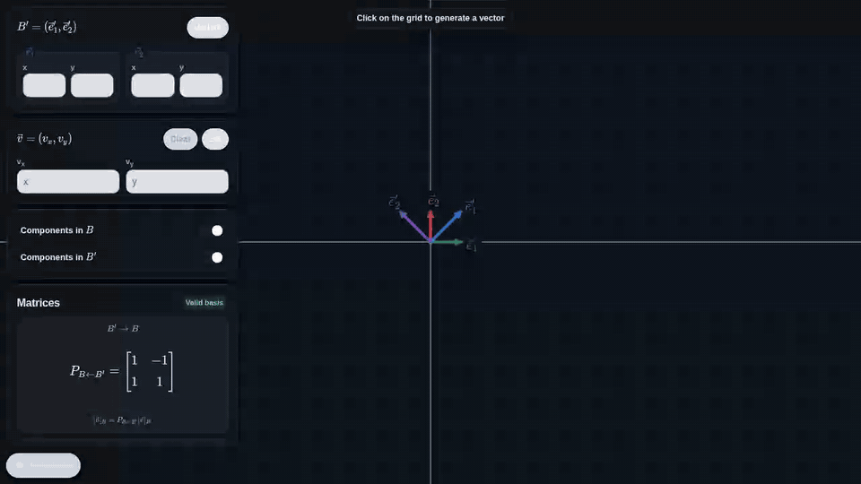

# Change of Basis Explorer

> **Access here:** [Change of Basis Explorer](https://rayleighlord.github.io/ChangeofBasis/)

An interactive browser-based explorer for visualizing a vector decomposed in two different bases
$B=(e_1,e_2)$ and $B'=(e'_1,e'_2)$, related by

$$
[\vec v]_B=P_{B\leftarrow B'}[\vec v]_{B'}.
$$

